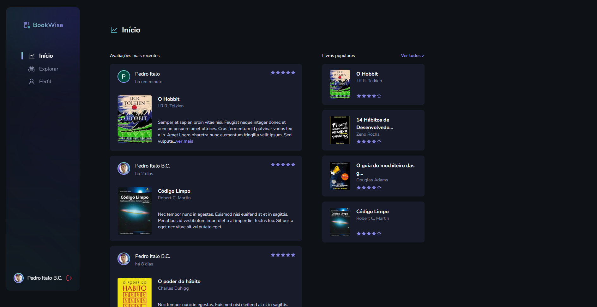
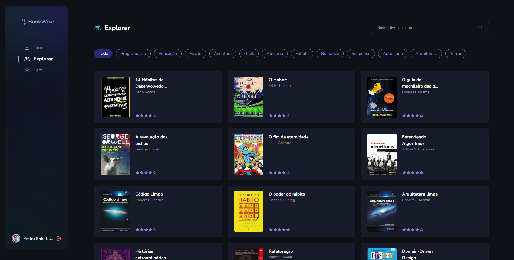
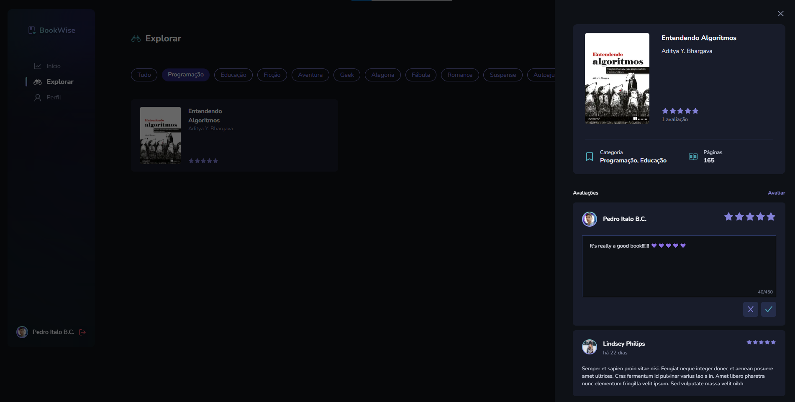

# Book-Wise 

This application is a system where you will have books and these books will be rated with stars and will also have comments.
You can authenticate with github and google

Esta aplicação é um sistema onde você terá livros e esses livros serão avaliados com estrelas e também terão comentários.
Você pode autenticar com github e google.

## Techs

* React
* Next js 13
* Tailwind CSS
* Prisma
* Axios

## Home

There is the home page (init) where the most recent comments are.

Existe a página inicial (init) onde estão os comentários mais recentes.

## Begin

There is also an explore page where you will have a book catalog.

Há também uma página de explorar, onde você terá um catálogo de livros.

## Explorer

In it you have a catalog of books where they can be filtered by categories or even by search.

Nele você tem um catálogo de livros onde podem ser filtrados por categorias ou até mesmo por busca.

You can also review a particular book.

Você também pode revisar um determinado livro

## Profile

On the profile page you can see some user data along with your ratings.

Na página de perfil, você pode ver alguns dados do usuário junto com suas avaliações.

